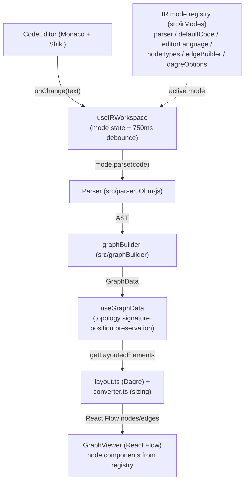

# Architecture

One-page orientation for the codebase. Read this first; follow the links for the details.

## Data flow

- Typing in the editor updates `code` state; after a 750 ms debounce, the active mode's
  `parse()` runs. Parse errors are caught and shown as a snackbar; the previous graph stays.
- `parse()` is parser + graphBuilder composed: text → AST → `GraphData` (plain, React-free).
- `useGraphData` decides between a full Dagre re-layout (topology changed) and a
  position-preserving content update (same topology). See `specs/graph-view.md`.
- Layout converts `GraphData` to React Flow nodes/edges, estimating node dimensions from
  shared font/style constants so Dagre's boxes match what CSS later renders.

## Layers

| Layer               | Directory                 | Responsibility                                                                             | React?      |
| ------------------- | ------------------------- | ------------------------------------------------------------------------------------------ | ----------- |
| Grammar + parser    | `src/parser`              | Ohm-js grammars (`*.ohm`) and semantics producing ASTs; lazy compile via `grammarCache.ts` | no          |
| AST types           | `src/ast`                 | Per-IR AST type definitions and small formatting helpers                                   | no          |
| Graph builder       | `src/graphBuilder`        | AST → `GraphData` (nodes/edges with `nodeType` + typed `astData`)                          | no          |
| Graph types         | `src/types/graph.ts`      | `GraphData`/`GraphNode`/`GraphEdge` — see `contracts/graph-data.md`                        | no          |
| IR mode registry    | `src/irModes`             | One `IRModeDefinition` per IR — see `contracts/ir-mode-registry.md`                        | import only |
| Layout / conversion | `src/utils`               | Dagre layout, React Flow node/edge construction, node sizing, font metrics                 | types only  |
| Hooks               | `src/hooks`               | `useIRWorkspace` (mode/code/parse/error), `useGraphData` (graph state), `usePaneResize`    | yes         |
| App shell           | `src/components/AppShell` | Toolbar, editor pane, graph pane, error display                                            | yes         |
| Graph rendering     | `src/components/Graph`    | React Flow node/edge components (+ colocated `*.stories.tsx`)                              | yes         |
| Editor              | `src/components/Editor`   | Monaco editor with Shiki highlighting for `llvm`/`mermaid`                                 | yes         |

Dependency direction: everything above the hooks row is UI-free and imports downward only
(parser → ast, graphBuilder → ast + types). The registry is the one place that ties an IR's
UI-free pipeline to its React components.

## Where behavior is specified

- `contracts/ir-mode-registry.md` — the interface an IR mode implements; how to add a 4th IR.
- `contracts/graph-data.md` — the `GraphData` shape and the `nodeType`↔`astData` union.
- `specs/llvm-ir.md`, `specs/mermaid.md`, `specs/selectiondag.md` — accepted input syntax and
  graph conversion rules per IR.
- `specs/graph-view.md` — mode-independent viewer behavior (debounce, position preservation,
  layout, sizing, responsive mode).

## Test / tooling layout

- Unit/integration: Vitest (`src/**/__tests__`, `src/__tests__/integration.test.ts`;
  `environment: "node"` by default, `// @vitest-environment jsdom` per file where DOM is needed).
- E2E: Playwright smoke suite (`e2e/smoke.spec.ts`) — boots the real app for all three modes.
- Storybook (`.storybook/`, stories colocated with node components) — visual catalog only.
- CI (`.github/workflows/ci.yml`): lint → format:check → test → build → build-storybook → E2E.
