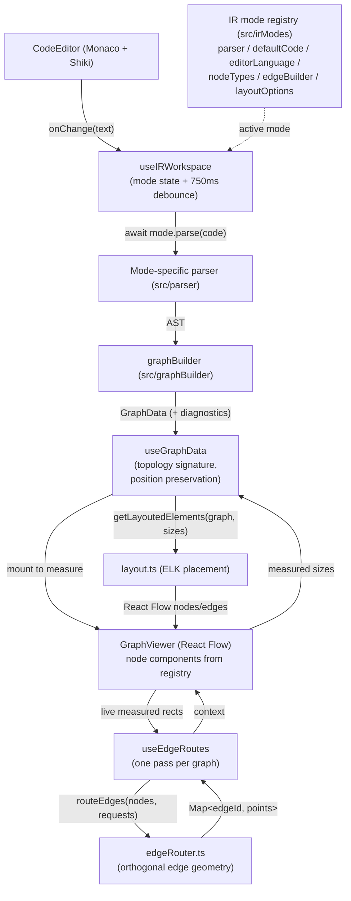

# Architecture

One-page orientation for the codebase. Read this first; follow the links for the details.

## Data flow

```mermaid
flowchart TD
  Editor["CodeEditor (Monaco + Shiki)"] -->|"onChange(text)"| Workspace["useIRWorkspace<br/>(mode state + 750ms debounce)"]
  Registry["IR mode registry (src/irModes)<br/>parser / defaultCode / editorLanguage /<br/>nodeTypes / edgeBuilder / layoutOptions"] -.->|"active mode"| Workspace
  Workspace -->|"await mode.parse(code)"| Parser["Mode-specific parser (src/parser)"]
  Parser -->|AST| Builder["graphBuilder (src/graphBuilder)"]
  Builder -->|"GraphData (+ diagnostics)"| GraphHook["useGraphData<br/>(topology signature,<br/>position preservation)"]
  GraphHook -->|"mount to measure"| Viewer["GraphViewer (React Flow)<br/>node components from registry"]
  Viewer -->|"measured sizes"| GraphHook
  GraphHook -->|"getLayoutedElements(graph, sizes)"| Layout["layout.ts (ELK placement)"]
  Layout -->|"React Flow nodes/edges"| Viewer
  Viewer -->|"live measured rects"| Routes["useEdgeRoutes<br/>(one pass per graph)"]
  Routes -->|"routeEdges(nodes, requests)"| Router["edgeRouter.ts<br/>(orthogonal edge geometry)"]
  Router -->|"Map&lt;edgeId, points&gt;"| Routes
  Routes -->|"context"| Viewer
```

- Typing in the editor updates `code` state; after a 750 ms debounce, the active mode's
  `parse()` runs. Parse failures are caught and shown in the editor panel's status footer; the
  previous graph stays.
- `parse()` is parser + graphBuilder composed: text → AST → `IRParseResult` (a `GraphData`
  plus the parse's recoverable diagnostics — plain, React-free). It is **async**
  (`contracts/ir-mode-registry.md`, "Parsing is asynchronous"): a parse whose code/mode/view
  changed while it was in flight is discarded, so a slow parse can never overwrite a newer one.
  Diagnostics take the same path as the error string — parse result to status footer — and
  never enter the layout stage. The parser module is `import()`ed on first parse, so only the
  selected mode's parser is ever fetched (`contracts/bundle-budget.md`).
- `useGraphData` decides between a full (async) measure-then-layout pass (topology
  changed) and a position-preserving content update (same topology). See
  `specs/graph-view.md`.
- Layout converts `GraphData` plus **measured** node sizes to React Flow nodes/edges.
  ELK never sees an estimate; spacing constants live in `src/utils/spacing.ts` and are
  shared with the live router. ELK computes **node placement only**. Nested graphs are
  compound ELK nodes and React Flow parent nodes (`contracts/graph-data.md`).
- Edge geometry is not part of the layout result. `src/hooks/useEdgeRoutes.ts` runs one
  routing pass per graph over React Flow's live measured node rects, calling
  `src/utils/edgeRouter.ts`, and publishes the resulting points per edge id through a
  context that `RoutedEdge` reads — so edges stay correct while nodes are dragged. See
  `specs/graph-view.md` §4 and `contracts/edge-routing.md`.

## Layers

| Layer               | Directory                  | Responsibility                                                                                                                                                                                    | React?      |
| ------------------- | -------------------------- | ------------------------------------------------------------------------------------------------------------------------------------------------------------------------------------------------- | ----------- |
| Grammar + parser    | `src/parser`               | Mode-specific text-to-AST parsing; Ohm-js grammars use lazy compilation via `grammarCache.ts`                                                                                                     | no          |
| AST types           | `src/ast`                  | Per-IR AST type definitions and small formatting helpers                                                                                                                                          | no          |
| Graph builder       | `src/graphBuilder`         | AST → `GraphData` (nodes/edges with `nodeType` + typed `astData`)                                                                                                                                 | no          |
| Graph types         | `src/types/graph.ts`       | `GraphData`/`GraphNode`/`GraphEdge` — see `contracts/graph-data.md`                                                                                                                               | no          |
| IR mode registry    | `src/irModes`              | One `IRModeDefinition` per IR — see `contracts/ir-mode-registry.md`                                                                                                                               | import only |
| Edge-routing types  | `src/types/edgeRouting.ts` | `Point`/`RouteSide`/`RouteNodeRect`/`RouteRequest`/`EdgeRouterOptions` — the frozen router boundary, see `contracts/edge-routing.md`                                                              | no          |
| Layout / conversion | `src/utils`                | ELK node placement (`layout.ts`, sizes in), shared spacing (`spacing.ts`), live orthogonal edge routing (`edgeRouter.ts`, types in `src/types/edgeRouting.ts`), React Flow node/edge construction | types only  |
| Hooks               | `src/hooks`                | `useIRWorkspace` (mode/code/parse/error/diagnostics), `useGraphData` (graph state), `useEdgeRoutes` (one routing pass per graph, published via context), `usePaneResize`                          | yes         |
| App shell           | `src/components/AppShell`  | `CanvasShell` (full-bleed `GraphViewer` root) + `EditorPanel` (header, Monaco, status footer)                                                                                                     | yes         |
| Graph rendering     | `src/components/Graph`     | React Flow node/edge components (+ colocated `*.stories.tsx`)                                                                                                                                     | yes         |
| Editor              | `src/components/Editor`    | Monaco editor; highlighting comes from the one shared Shiki instance (`src/utils/highlighter.ts`) over the grammars declared in `src/irModes/editorLanguages.ts`                                  | yes         |

The shell is **canvas-first**: `App.tsx` composes two layers — `CanvasShell`, which makes
`GraphViewer` the full-viewport root, and `EditorPanel`, a floating card (a DOM sibling of the
React Flow canvas) holding the mode selector, the view toggle, Clear, the Monaco editor, and a
status footer that reports parse success/failure. There is no app toolbar, editor toolbar, or
error snackbar; viewport and layout controls live in a `CanvasControls` cluster inside the
canvas. See `specs/graph-view.md` §6.

Dependency direction: everything above the hooks row is UI-free and imports downward only
(parser → ast, graphBuilder → ast + types). The registry is the one place that ties an IR's
UI-free pipeline to its React components.

## Where behavior is specified

- `contracts/ir-mode-registry.md` — the interface an IR mode implements; how to add a 4th IR.
- `contracts/graph-data.md` — the `GraphData` shape and the `nodeType`↔`astData` union.
- `contracts/edge-routing.md` — the frozen `routeEdges` boundary and the guarantees callers
  may rely on.
- `contracts/bundle-budget.md` — the two size numbers the build is held to, and the two
  import rules that keep it under them.
- `specs/llvm-ir.md`, `specs/mermaid.md`, `specs/selectiondag.md` — accepted input syntax and
  graph conversion rules per IR.
- `specs/llvm-use-def-view.md` — the LLVM-IR mode's second view (SSA dataflow projection).
- `specs/graph-view.md` — mode-independent viewer behavior (debounce, position preservation,
  measure-then-layout ELK placement, live edge routing, node sizing, canvas-first shell
  and its design tokens).

## Test / tooling layout

- Unit/integration: Vitest (`src/**/__tests__`, `src/__tests__/integration.test.ts`;
  `environment: "node"` by default, `// @vitest-environment jsdom` per file where DOM is needed).
- E2E: Playwright smoke suite (`e2e/smoke.spec.ts`) — boots the real app for all three modes.
- Storybook (`.storybook/`, stories colocated with node components) — visual catalog only.
- CI (`.github/workflows/ci.yml`): lint → format:check → test → build → bundle budget →
  build-storybook → E2E. The budget step is `npm run check:bundle`
  (`contracts/bundle-budget.md`); it reads the `dist/` the build step just produced.
