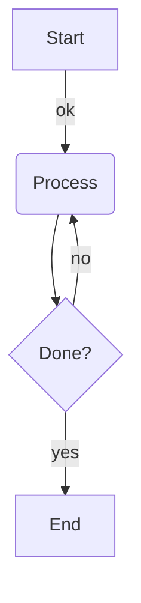

# Supported input formats

What each mode accepts, where to get such input, and the main limitations. The precise,
test-backed rules live in the internal specs (`docs/internal/specs/`); this page is the
practical summary.

## LLVM-IR

Textual LLVM-IR modules: function definitions plus module-level entries (global variables,
`declare` lines, metadata, attribute groups, `target ...`, `source_filename`, type aliases,
comdats, `module asm`).

**Get it from:** `clang -S -emit-llvm -o out.ll input.c`, or `opt -S` on bitcode. Output
from old LLVM releases works too — see the version table below.

**Example** (paste into the app in LLVM-IR mode):

```llvm
@g = global i32 0

define i32 @max(i32 %a, i32 %b) {
entry:
  %cmp = icmp sgt i32 %a, %b
  br i1 %cmp, label %then, label %else

then:
  ret i32 %a

else:
  ret i32 %b
}
```

**Version coverage:** parsing is line-oriented and only reads the structure the graph
needs — block labels and terminators; instruction bodies are kept as text. That makes the
parser insensitive to most syntax differences between LLVM releases, so printer output from
LLVM ~2.x through current is accepted:

| LLVM version | Era-specific syntax that is accepted                                                                                                                                        |
| ------------ | --------------------------------------------------------------------------------------------------------------------------------------------------------------------------- |
| ~2.x         | typed pointers (`i8*`), function-pointer call types, one-line `invoke`, the old `unwind` terminator                                                                         |
| 3.x–6.x      | unnamed blocks printed only as `; <label>:N` comments, old-style `load i8* %p` / `getelementptr` (no separate pointee type), `!llvm.loop` / `!prof` suffixes on terminators |
| 7.x–13.x     | printed numeric block labels (`7:`), explicit pointee types                                                                                                                 |
| 14+          | opaque `ptr`, `#dbg_value(...)` debug records, `callbr`                                                                                                                     |
| any          | `comdat`, `module asm`, `uselistorder` — accepted and ignored                                                                                                               |

**Graph structure:** every basic block becomes a node and every terminator becomes the
block's outgoing edges. Conditional `br` edges are labeled `true` / `false`; `switch` gets a
`default` edge plus one edge per case, labeled with the case value; `invoke` gets a `to`
edge (normal path) and an `unwind` edge (exception path); `ret` connects to a shared
per-function exit node; `unreachable`, `resume`, and the old `unwind` end their block as a
dead end — no outgoing edge, not even to the exit node. Other terminators (`callbr`,
`indirectbr`, ...) get one unlabeled edge per `label %target` they mention.

**Error recovery:**

- A line **inside a function** that the parser does not recognize never fails the parse: it
  is kept as an opaque instruction in its block. The graph still renders; that line just
  contributes text, not structure.
- Anything **outside a function** that is not a recognized module entry is a parse error and
  rejects the whole input — pasting non-IR shows an error instead of a misleading graph.
- Structural problems (a block without a terminator before `}`, an unclosed function, ...)
  are parse errors that name the offending line.

The precise, test-backed rules live in the
[LLVM-IR spec](../internal/specs/llvm-ir.md).

## SelectionDAG

Textual SelectionDAG dumps from `llc` — the blocks that look like:

```
Optimized legalized selection DAG: %bb.0 'max:entry'
SelectionDAG has 6 nodes:
  t0: ch,glue = EntryToken
  t2: i64,ch = CopyFromReg t0, Register:i64 %0
  t4: i64,ch = CopyFromReg t0, Register:i64 %1
  t7: i64 = add t2, t4
  t9: ch,glue = CopyToReg t0, Register:i64 $x10, t7
  t10: ch = RISCVISD::RET_GLUE t9, Register:i64 $x10, t9:1
```

**Get it from:** an assertions-enabled (debug) LLVM build:

```sh
llc -debug-only=isel -o /dev/null input.ll 2> dump.txt
```

The output contains one dump per selection phase (unoptimized, optimized, legalized, ...) per
basic block — copy the section for the phase you want to look at. Old-style dumps with
`0x...` node ids and `[ORD=N]` markers are also accepted.

**Behavior to know about:** parsing is line-by-line and never fails — header text and anything
that doesn't look like a `tN: ... = ...` node line is silently ignored. That makes pasting a
whole dump section painless, but it also means a **typo in a node line silently drops that
node** (and its edges) instead of showing an error.

## Mermaid

A subset of [Mermaid flowchart](https://mermaid.js.org/syntax/flowchart.html) notation:



Supported: `graph`/`flowchart` headers with `TB|TD|BT|RL|LR` directions; nodes with square
`[..]`, round `(..)`, and curly `{..}` labels; `-->` / `---` links with optional `|label|` or
`--label-->` labels; newline or `;` separated statements.

**Limitations to know about:**

- Subgraphs, styling, multi-link chains (`A --> B --> C`), other node shapes, and `%%`
  comment lines are not supported (comments currently cause a parse error).
- Edge labels are displayed with their pipe delimiters (`|yes|`), matching how they are
  written.
