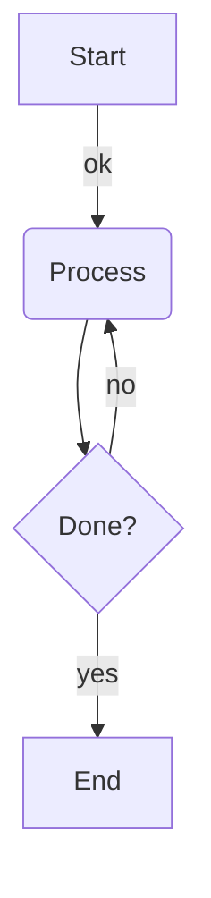

# Supported input formats

What each mode accepts, where to get such input, and the main limitations. The precise,
test-backed rules live in the internal specs (`docs/internal/specs/`); this page is the
practical summary.

## LLVM-IR

Textual LLVM-IR modules: function definitions plus module-level entries (global variables,
`declare` lines, metadata, attribute groups, `target ...`, `source_filename`).

**Get it from:** `clang -S -emit-llvm -o out.ll input.c`, or `opt -S` on bitcode.

**Example** (paste into the app in LLVM-IR mode):

```llvm
@g = global i32 0

define i32 @max(i32 %a, i32 %b) {
entry:
  %cmp = icmp sgt i32 %a, %b
  br i1 %cmp, label %then, label %else

then:
  ret i32 %a

else:
  ret i32 %b
}
```

**Limitations to know about:**

- Blocks must end with `br`, `ret`, or `switch`. Functions using other terminators
  (`invoke`, `unreachable`, ...) fail to parse — and a parse failure rejects the whole input.
- Instruction bodies are mostly treated as text; the graph structure comes from block labels
  and terminators only. Exotic instruction syntax occasionally trips the parser; if it does,
  simplify or remove the offending line.

## SelectionDAG

Textual SelectionDAG dumps from `llc` — the blocks that look like:

```
Optimized legalized selection DAG: %bb.0 'max:entry'
SelectionDAG has 6 nodes:
  t0: ch,glue = EntryToken
  t2: i64,ch = CopyFromReg t0, Register:i64 %0
  t4: i64,ch = CopyFromReg t0, Register:i64 %1
  t7: i64 = add t2, t4
  t9: ch,glue = CopyToReg t0, Register:i64 $x10, t7
  t10: ch = RISCVISD::RET_GLUE t9, Register:i64 $x10, t9:1
```

**Get it from:** an assertions-enabled (debug) LLVM build:

```sh
llc -debug-only=isel -o /dev/null input.ll 2> dump.txt
```

The output contains one dump per selection phase (unoptimized, optimized, legalized, ...) per
basic block — copy the section for the phase you want to look at. Old-style dumps with
`0x...` node ids and `[ORD=N]` markers are also accepted.

**Behavior to know about:** parsing is line-by-line and never fails — header text and anything
that doesn't look like a `tN: ... = ...` node line is silently ignored. That makes pasting a
whole dump section painless, but it also means a **typo in a node line silently drops that
node** (and its edges) instead of showing an error.

## Mermaid

A subset of [Mermaid flowchart](https://mermaid.js.org/syntax/flowchart.html) notation:



Supported: `graph`/`flowchart` headers with `TB|TD|BT|RL|LR` directions; nodes with square
`[..]`, round `(..)`, and curly `{..}` labels; `-->` / `---` links with optional `|label|` or
`--label-->` labels; newline or `;` separated statements.

**Limitations to know about:**

- Subgraphs, styling, multi-link chains (`A --> B --> C`), other node shapes, and `%%`
  comment lines are not supported (comments currently cause a parse error).
- Edge labels are displayed with their pipe delimiters (`|yes|`), matching how they are
  written.
